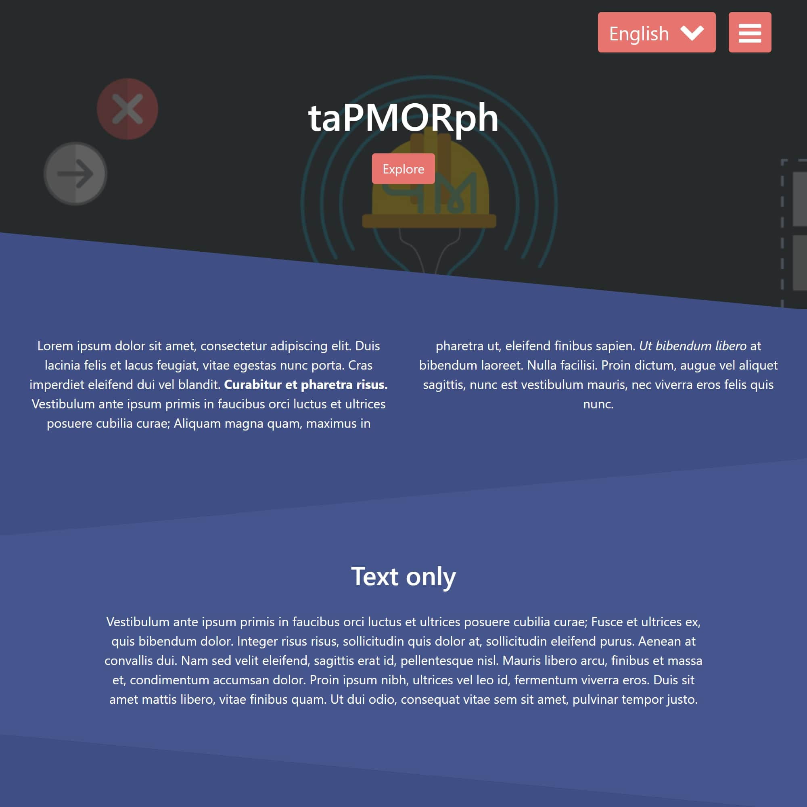

# taPMORph trapezes



**taPMORph trapezes** is a theme developed by [taPMeppe solutions](https://tapmeppe.solutions) for the [GRAV CMS](https://getgrav.org/). 
It is based on the free template [Solid State | HTML5 UP](https://html5up.net/solid-state). :loudspeaker: :+1:

## Installation :nut_and_bolt:
Installing this theme can be done in one of two ways. The GPM (_Grav Package Manager_) installation method enables you to quickly and easily install the theme with a simple terminal command, while the manual method enables you to do so via a zip file.

### GPM Installation (_Preferred_)
The simplest way to install this theme is via the [Grav Package Manager (GPM)](http://learn.getgrav.org/advanced/grav-gpm) through your system's Terminal (_also called the command line_). From the root of your Grav install type:
```
bin/gpm install tapmorph-trapezes
```
This will install this theme into your `/user/themes` directory within Grav. Its files can be found under `__YOUR_SITE__/grav/user/themes/tapmorph-trapezes`.

### Manual Installation
To install this theme, just download the zip version of this repository and unzip it under `__YOUR_SITE__/grav/user/themes`. Then, rename the folder to `tapmorph-trapezes`. You can find these files either via [GetGrav.org](https://getgrav.org/downloads/themes) or on [GitHub](https://github.com/taPMeppeSols/grav-theme-tapmorph-trapezes).<br> You should now have all the theme files under `__YOUR_SITE__/grav/user/themes/tapmorph-trapezes`.


## Updating :gear:
As development for this theme continues, new versions may become available that add additional features and functionality, improve compatibility with newer Grav releases, and generally provide a better user experience. Updating this theme is easy, and can be done through Grav's GPM system, as well as manually.

### GPM Update (_Preferred_)
The simplest way to update this theme is via the [Grav Package Manager (GPM)](http://learn.getgrav.org/advanced/grav-gpm). You can do this with this by navigating to the root directory of your Grav install using your system's Terminal (_also called command line_) and typing the following:
```
bin/gpm update tapmorph-trapezes
```
This command will check your Grav install to see if this theme is due for an update. If a newer release is found, you will be asked whether or not you wish to update. To continue, type `y` and hit `enter`. The theme will automatically update and clear Grav's cache.

### Manual Update
Manually updating this theme is pretty simple. Here is what you will need to do to get this done:
* Delete the `__YOUR_SITE__/user/themes/tapmorph-trapezes` directory.
* Download the new version of the this theme from either via [GetGrav.org](http://getgrav.org/downloads/themes).
* Unzip the zip file in `__YOUR_SITE__/user/themes` and rename the resulting folder to `tapmorph-trapezes`.
* Clear the Grav cache. The simplest way to do this is by going to the root Grav directory in terminal and typing `bin/grav clear-cache`.

> Any changes you have made to any of the files listed under this directory will also be removed and replaced by the new set. Any files located elsewhere (_for example a YAML settings file placed in_ `user/config/themes`) will remain intact.


## Setup :electric_plug:
### Theme
If you want to set this theme as the default theme, you can do so by following these steps:
* Navigate to `__YOUR_SITE__/grav/user/config`.
* Open the **system.yaml** file.
* Change the `theme:` setting to `theme: tapmorph-trapezes`.
* Save your changes.
* Clear the Grav cache. The simplest way to do this is by going to the root Grav directory in Terminal and typing `bin/grav clear-cache`.

Once this is done, you should be able to see the new theme on the frontend. Keep in mind any customizations made to the previous theme will not be reflected as all of the theme and templating information is now being pulled from the **tapmorph-trapezes** folder.

### Newsletter
To activate the newsletter form the following conditions must be met:
* A privacy policy page must be set in the theme configurator.
* At least one registration recipient must be set in the theme configurator.

### Subscribers
To access the subscribers list create a empty page using the 'Subscribers' page template. 
Afterwards start the preview mode.<br>
> The double opt-in process is used by default. Once the subscription process is done the email addresses are stored locally in a flat file.


## Shortcodes
### ``trapezeAnchor``
* **class** Similar to the HTML class attribute.
* **href** Represents to the HTML href attribute.
* **target** Represents to the HTML target attribute & overwrites the default smart determination.
* **label** The content of the resulting HTML anchor.
* **\_content_** Used if the **label** isn't set.
```yaml
[trapezeAnchor class="" href="" target="" label="THE_CONTENT_IS_PLACED_HERE"/]
[trapezeAnchor class="" href="" target=""]
THE_CONTENT_IS_PLACED_HERE
[/trapezeAnchor]
```

### ``trapezeAnchors``
* **class** Similar to the HTML class attribute.
* **id** Represents to the HTML id attribute.
```yaml
[trapezeAnchors class="" id=""]
[trapezeAnchor class="" href="" target="" label="THE_CONTENT_IS_PLACED_HERE"/]
[trapezeAnchor class="" href="" target=""]
THE_CONTENT_IS_PLACED_HERE
[/trapezeAnchor]
[/trapezeAnchors]
```

### ``trapezeBlock``
* **class** Similar to the HTML class attribute.
* **id** Represents to the HTML id attribute.
* **compact** If `0` or _UNSET_ the text will NOT be compact.
* **image** The URL of the background image.
* **\_content_** The block content.
```yaml
[trapezeBlock class="" id="" image=""]
Lorem ipsum dolor sit amet, consectetur adipiscing elit. 
Duis lacinia felis et lacus feugiat, vitae egestas nunc porta. 
Cras imperdiet eleifend dui vel blandit.
_Ut bibendum libero_ at bibendum laoreet.
**Nunc accumsan** euismod nisl a ultricies.
<video controls>
	<source src="">
</video>
[/trapezeBlock]
[trapezeBlock class="" id="" image="" compact=1]
Lorem ipsum dolor sit amet, consectetur adipiscing elit. 
Duis lacinia felis et lacus feugiat, vitae egestas nunc porta. 
Cras imperdiet eleifend dui vel blandit.
_Ut bibendum libero_ at bibendum laoreet.
**Nunc accumsan** euismod nisl a ultricies.
<video controls>
	<source src="">
</video>
[/trapezeBlock]
```

### ``trapezeCarousel``
* **class** Similar to the HTML class attribute.
* **id** Represents to the HTML id attribute.
* **image** The URL of the background image.
* **fixed** If `0` or _UNSET_ the background image will NOT be fixed.
* **interval** the amount in milliseconds of time to delay between automatically switch to the next item. Set to `false` to prevent the automatic switch.
* **fade** If `0` or _UNSET_ the switch will be done by sliding instead of fading.
* **indicators** If `0` the indicators at the bottom will be omitted. 
* **controls** If `0` the controls at the left & right will be omitted. 
* **\_content_** The block content.
> For more information visit the [Bootstrap carousel documentation](https://getbootstrap.com/docs/5.1/components/carousel/).
```yaml
[trapezeCarousel class="" id="" image="" fixed="" interval="0" fade="0" indicators="0" controls="0"]
[trapezeCarouselItem/]
[/trapezeCarousel]
```

### ``trapezeCarouselItem``
* **title** The item title.
* **interval** the individual amount in milliseconds of time to delay between automatically cycling to the next item.
* **compact** If `0` or _UNSET_ the text will NOT be compact.
* **image** The image URL.
* **\_content_** The item content.
* **block** If `0` or _UNSET_ the content will be treated as a block.
```yaml
[trapezeCarousel class="" id="" image="" fixed="" interval="5000" fade="1" indicators="1" controls="1"]
[trapezeCarouselItem title="" image=""]
Lorem ipsum dolor sit amet, consectetur adipiscing elit. 
_Ut bibendum libero_ at bibendum laoreet.
**Nunc accumsan** euismod nisl a ultricies.
[/trapezeCarouselItem]
[trapezeCarouselItem block=1 interval=0]
<video controls>
<source src="">
</video>
[/trapezeCarouselItem]
[/trapezeCarousel]
```

### ``trapezeParagraph``
* **class** Similar to the HTML class attribute.
* **id** Represents to the HTML id attribute.
* **image** The image URL.
* **title** The paragraph title.
* **background** If `0` or _UNSET_ the image will NOT be placed in the background.
* **fixed** If `0` or _UNSET_ the background image will NOT be fixed.
* **compact** If `0` or _UNSET_ the text will NOT be compact.
* **\_content_** The paragraph content.
```yaml
[trapezeParagraph class="" id="" image="" title="" background="1" fixed="1" compact="1"]
Lorem ipsum dolor sit amet, consectetur adipiscing elit. 
_Ut bibendum libero_ at bibendum laoreet.
**Nunc accumsan** euismod nisl a ultricies.
[/trapezeParagraph]
```


## Customisation :hammer: :wrench:
### Theme
All customisation should be done using [theme inheritance](https://learn.getgrav.org/17/themes/customization#theme-inheritance) to allow for future updates. This way we can keep updating and you can keep the feature you care about. I hope we all have as much fun as we. Good luck :smiley: :muscle: :metal: .

### Subscribers
To customise the subscribing process:
* copy `__YOUR_SITE__/user/themes/tapmorph-trapezes/helpers/SubscribersCustom.php`,
* paste it in `__YOUR_SITE__/user/data/tapmorph-trapezes/SubscribersCustom.php` and
* adapt the `protected` functions to your liking.


## Preview :see_no_evil: :hear_no_evil: :speak_no_evil:
The theme created as response to our need for a simple and lightweight solution for the online presence of our team. Therefore, currently there is no better preview than our [homepage](https://tapmeppe.solutions).<br>
You can alternatively visit the [demo site](https://demo.trapezes.tapmeppe.solutions).

The following browsers have been test and are fully supported:
- [brave](https://brave.com/) (version 1.4.95 x64-bit)
- [VIVALDI](https://vivaldi.com/) (version 2.5.1525.43 x64-bit)
- [Opera](https://www.opera.com/) (version 67.0.3575.31)
- [Chrome](https://www.google.com/chrome/) (version 80.0.3987.122 x64-bit)
- [Firefox](https://www.mozilla.org/firefox/) (version 73.0.1 x64-bit)
- [Edge](https://www.microsoft.com/edge) (version 44.18362.449.0)
- [Edge Chromium](https://www.microsoft.com/edge) (version 84.0.522.52 x64-bit)

The following browsers are still up for testing:
- [Safari](https://www.apple.com/safari/)


## You want to support us? :ok_hand: :gift:
No problem buddy. We can always use some loose change :money_with_wings: for a cup of :coffee:. You can donate [here](https://paypal.me/tapmeppesols). 

## :v: :wave: :end:
